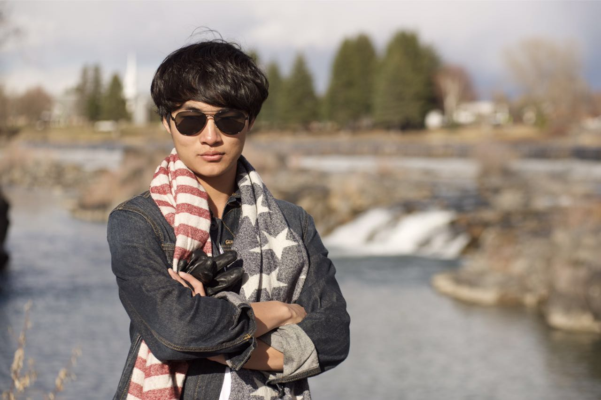

<!-- Banner -->
<!-- Note: The "styleN" class below should match that of the header element. -->
<section id="banner" class="style2">
	

		
			
		
		<header class="major">
			<h1>Landing</h1>
		</header>
		

			
{{ page.description }}

		

	

</section>

<!-- Main -->

<!-- One -->
<section id="one">
	

		<header class="major">
			<h2>How I Started</h2>
		</header>
		
Ever since middle school, I have been really interested in all forms of media form. I’ve set my foot in Film making, 3D modeling and all sorts of designs. However, when I had my first DSLR camera, I knew that was going to be my passion. Since then, I have been traveling around the world. By the end of 2016, I will complete my goal for traveling to all seven continents around the world.

	

</section>

<!-- Two -->
<section id="two" class="spotlights">
	<section>
		
		

			

				<header class="major">
					<h3>Skills</h3>
				</header>
				
Programming Languages: Swift, Objective-C, Python, Java, C++, Arduino, Racket, Prolog, Verilog, HTML, CSS, JavaScript, Assembly, MatLab, jQuery, AngularJS, AJAX, JSON

				
Software: Photoshop, After Effect, Final Cut Pro, Logic Pro X, SketchUp, SolidWorks, AutoCAD, Illustrator, KiCAD, JFLAP, JAPE, Quartus, ModelSim, uVision...

				<ul class="actions">
					<li><a href="generic.html" class="button">Learn more</a></li>
				</ul>
			

		

	</section>
	<section>
		
		

			

				<header class="major">
					<h3>Education</h3>
				</header>
				
Harvey Mudd College, Claremont, CA, August 2014 – May 2018

				
Stanford University, Stanford, CA, summer 2013

				<ul class="actions">
					<li><a href="generic.html" class="button">Learn more</a></li>
				</ul>
			

		

	</section>
	<section>
		
		

			

				<header class="major">
					<h3>Experience</h3>
				</header>
				
Yelp, iOS intern, San Francisco, CA, summer 2016

				
Cameric, Co-founder & CEO, Chongqing, China, August 2015 – now

				<ul class="actions">
					<li><a href="generic.html" class="button">Learn more</a></li>
				</ul>
			

		

	</section>
</section>

<!-- Three -->
<section id="three">
	

		<header class="major">
			<h2>More</h2>
		</header>
		
Let’s get in touch.

		<ul class="actions">
			<li><a href="generic.html" class="button next">More</a></li>
		</ul>
	

</section>

